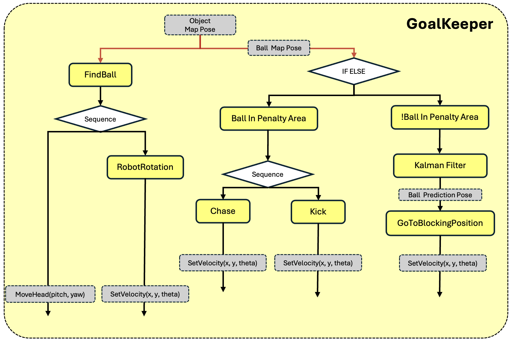

# INHA-GoalKeeper
<p align="center">

</p>

Hi 👋 We are Inha-United !
Inha-United is a team competing in the RoboCup Soccer Humanoid League.

This repository focuses on algorithms and methodologies for goalkeeper behavior decision-making in autonomous humanoid soccer, based on the **BehaviorTree.CPP** framework.

Starting from the demo provided by Booster Robotics, we have modularized the system, extended its functionality, and continuously improved its performance through our own research and development efforts.

## Decision-Making Framework
The goalkeeper’s decision-making framework is composed of three high-level states: **Hold**, **Clearing**, and **Find**.

* **Hold**:
In this state, the robot predicts the ball trajectory and continuously computes and moves to the optimal position that minimizes the opponent’s shooting angle.

* **Clearing**:
When the ball enters a critical area, the goalkeeper performs a clearing action, kicking the ball away toward the direction opposite the goal.

* **Find**:
If the ball position is lost, the robot combines head rotation and body rotation to obtain an omnidirectional field of view and re-locate the ball efficiently.

The detailed decision-making process is illustrated in the figure below.


## Installation & Run
```bash
mkdir  ~/INHA_GoalKeeper
git clone https://github.com/Eunbyeol-0/Soccer_Goalkeeper.git

# Build 
./scripts/build.sh

# Start
./scripts/start.sh
